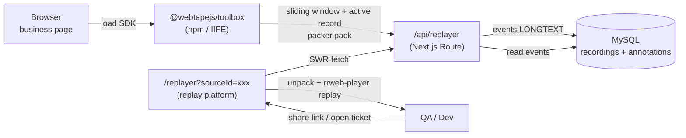

<div align="center">

# 📺 Web Tape

**Bug reproduction tool — upgrade your feedback channel, help dev & QA locate issues faster**

One `<script>` tag or a single `import` records page interactions, network requests
and console logs. The replay platform gives you a scrubbing timeline, annotation-based
communication, cURL reproduction and AI summaries — so "cannot reproduce" is a thing of the past.

[English](./README.en.md) · [简体中文](./README.md)

[Quick Start](#-quick-start) ·
[Features](#-features) ·
[Architecture](#-architecture)

</div>

---

## 💡 What is it

Web Tape is a monorepo with two cooperating parts — **capture** and **consume**:

| Directory                                | Role                    | Form                     | Distribution                                  |
| ---------------------------------------- | ----------------------- | ------------------------ | --------------------------------------------- |
| [`packages/toolbox`](./packages/toolbox) | Browser recording SDK   | npm package + IIFE `.js` | `npm i @webtapejs/toolbox` / CDN `<script>`   |
| [`apps/replayer`](./apps/replayer)       | Replay & analysis app   | Next.js app + MySQL      | One-command script / self-hosted Docker       |

- **Capture the scene**: hit the floating record button, or let Sentinel mode auto-capture failed
  requests, and get a shareable replay link.
- **Reproduce precisely**: open the link to see actions, network requests and console logs aligned
  on one timeline; annotate on the frame and copy any request as cURL.
- **Zero business changes**: drop in one `<script>` (or `import`); the SDK is fully isolated.

---

## ✨ Features

### 🎬 Capture · `packages/toolbox`

- 🚨 **Sentinel mode**: watches HTTP 4xx/5xx, prompts to report on hit; URL / status-code allowlist.
- 🔁 **Background sliding window**: runs on load, always keeps the last N seconds (default 30s) in memory via double buffering.
- ⏪ **One-click rewind**: no need to start recording in advance — upload the sliding window's scene when a bug happens.
- 📼 **Active recording**: bottom-right FAB, with confirmation + duration guard (default 3 min cap).
- 🌐 **Full network & console capture**: XHR monkey-patch + rrweb console plugin, all merged into one event stream.
- 🗜️ **Compressed upload**: packed via `@rrweb/packer` to avoid gateway truncation of large payloads.

### 📺 Replay · `apps/replayer`

- 🎚️ **Drag-to-scrub timeline**: Pointer Events + rAF frame coalescing; `skipInactive: false` keeps idle segments.
- ⌨️ **Keyboard shortcuts**: `Shift+Space` play/pause, `←/→` seek 4s (works inside and outside the iframe).
- 🖍️ **Annotations**: pause and drop pins anywhere, 5 colors, sidebar discussion; 0–1 relative coords fit any resolution.
- 🌐 **Network panel**: waterfall + auto-parsed query params + JSON tree + **copy as cURL**.
- 📋 **Console panel**: filter by level, aligned with the playhead.
- 🤖 **AI summary**: feeds network + console + DOM to a Workflow API to locate the root cause.
- 🌓 **Dark / light theme**: draggable floating toggle that snaps to corners.

---

## 🏗️ Architecture



### Data-flow notes

- **Compress before upload**: `snapshot.map(pack)` turns events into a base64 string array.
- **Replay compatibility**: `useEvents.ts` detects a string first element and `map(unpack)`s it; legacy `object[]` data passes through.
- **Annotations table**: `annotations` FK to `recordings.id` with `onDelete: Cascade`; a submit runs `deleteMany + createMany` in a transaction (full overwrite).
- **App-level CORS**: the SDK uploads cross-origin from business pages; `src/proxy.ts` injects CORS based on `CORS_ALLOW_ORIGIN` (enable it when self-hosting without a gateway; leave empty when a gateway handles CORS).

---

## 🚀 Quick Start

Web Tape is **one system: capture + replay**. The SDK records and uploads; the replay service stores and serves. So a full setup needs **a replay service first, then the SDK** — both are required.

| Step | What | Section |
| --- | --- | --- |
| **Step 1** | Deploy the replay service (one command → get your `serverUrl`) | [① Self-host the replay service](#-1-self-host-the-replay-service) |
| **Step 2** | Add the SDK to your page, point `serverUrl` at step 1 | [② Add the SDK](#-2-add-the-sdk) |
| Develop | Run the source / contribute | [③ Local development](#-3-local-development) |

> Without a replay service there is nowhere to upload recordings and nothing to replay. There is no public hosted service — you self-host.

---

### ① Self-host the replay service

With Docker installed, one command does it all — generates a random MySQL password, brings up MySQL + the replayer. **No manual `.env`, no clone needed**:

```bash
curl -fsSL https://raw.githubusercontent.com/chernbo/webTape/main/deploy/install.sh | bash
```

Then open `http://localhost:3100`; your upload endpoint is `http://localhost:3100/api/replayer` (use it as `serverUrl` in step 2). Optional:

```bash
WEBTAPE_PORT=8080 bash install.sh     # custom port / or download the script and run locally
```

- **Prerequisites**: Docker + Docker Compose v2.
- **Production**: put your own reverse proxy (Nginx / Caddy / …) with HTTPS in front of `:3100`, and set `REPLAYER_PUBLIC_URL` in the generated `.env` to your public domain.

> 🔓 **The upload endpoint is unauthenticated by design**: the capture side is a one-line script injected into arbitrary pages, so auth on the upload endpoint would leak a secret into client code. Add auth yourself at the reverse-proxy / gateway layer (Basic Auth, IP allowlist, private network); don't expose an unprotected instance to the public internet.

---

### ② Add the SDK

The capture side is published as [`@webtapejs/toolbox`](https://www.npmjs.com/package/@webtapejs/toolbox). Point `serverUrl` at **the replay service you deployed in step 1**.

**npm (recommended for app projects)**

```bash
npm install @webtapejs/toolbox
# or: pnpm add @webtapejs/toolbox / yarn add @webtapejs/toolbox
```

```ts
import { configure, mountFab } from '@webtapejs/toolbox'

configure({
  // required: the endpoint from step 1 — locally this is http://localhost:3100/api/replayer
  serverUrl: 'http://localhost:3100/api/replayer',
  autoBackgroundRecord: true,
  errorPrompt: true,
})
mountFab() // mount the built-in floating button; skip it to stay silent and render your own UI
```

**CDN `<script>` (zero code, for QA / staging pages)**

```html
<script src="https://unpkg.com/@webtapejs/toolbox/dist/web-tape.iife.js"></script>
<script>
  window._webTape.configure({
    serverUrl: 'http://localhost:3100/api/replayer',
    autoBackgroundRecord: true,
    errorPrompt: true,
  })
</script>
```

Full API / config in the [`packages/toolbox` README](./packages/toolbox#readme).

> ⚠️ Data masking is on the roadmap; for now **inject only in test / staging**. The SDK starts background recording on load — mount it in production user environments with caution.

---

### ③ Local development

> Developing this repo requires [pnpm](https://pnpm.io) (it uses a pnpm workspace + lockfile; npm/yarn will miss the relevant config). Consumers of the SDK don't need pnpm.

For running the source or contributing (app runs on host with hot reload, only MySQL in Docker):

```bash
cd apps/replayer
pnpm install
cp .env.example .env         # local DATABASE_URL is pre-filled
docker compose up -d         # local MySQL 8.4 (compose.yaml, port 3306)
pnpm prisma db push          # create tables from schema (no migration files, use db push)
pnpm dev                     # http://localhost:3100
```

SDK development:

```bash
cd packages/toolbox
pnpm install
pnpm dev                     # http://localhost:5173 (built-in demo page)
pnpm build                   # dist/: index.mjs (npm) + web-tape.iife.js (CDN) + *.d.ts
```

---

## 📁 Layout

```
webTape/
├── README.md                      Simplified Chinese
├── README.en.md                   ← you are here (English)
├── packages/
│   └── toolbox/                   Browser recording SDK (Vite → npm + IIFE)
└── apps/
    └── replayer/                  Replay platform (Next.js 16 + Prisma + MySQL)
```

---

## 🛠️ Tech stack

| Category   | Choice                                             |
| ---------- | -------------------------------------------------- |
| Recording  | rrweb 2.x · `@rrweb/packer`                        |
| Replay     | Next.js 16 (App Router) + React 18                 |
| UI         | Ant Design 6                                       |
| Data       | SWR 2.x                                            |
| Storage    | Prisma + MySQL                                     |
| Bundling   | SDK: Vite 7 (ESM + IIFE) · Replayer: Next.js build |
| Styling    | Sass Modules + CSS variable themes                 |
| Package mgr| pnpm                                               |

---

## 🤝 Contributing

Issues / PRs welcome, especially:

- 🔌 **More framework adapters**: React / Vue today; Angular / Svelte welcome.
- 🧠 **Better AI analysis**: structured user-action paths + Agent-consumable metadata.
- 🔗 **Ticketing integration**: push replay link + AI summary into Jira / GitHub Issues.
- 🌍 **Multi-platform**: mini-programs / mobile WebView.

Run `pnpm lint` and `pnpm build` in the relevant sub-directory before submitting.

---

## 📄 License

[MIT](./LICENSE)

Web Tape is built on [rrweb](https://github.com/rrweb-io/rrweb). Kudos to the rrweb team.
