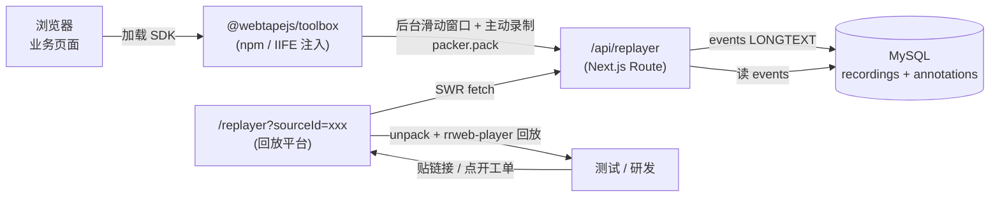

<div align="center">

# 📺 Web Tape

**Bug 现场还原工具｜升级用户反馈渠道，加速产研定位问题**

一行 `<script>` 或一次 `import` 即可录制页面操作、网络请求与控制台日志，
搭配回放平台提供时间轴回放、批注沟通、cURL 复现与 AI 摘要，
彻底告别「无法复现」的沟通成本。

简体中文 · [English](./README.en.md)

[快速开始](#-快速开始) ·
[核心特性](#-核心特性) ·
[架构](#-架构)

</div>

---

## 💡 项目定位

Web Tape 是一个 monorepo，由两个独立又协作的部分组成，分别负责**采集**和**消费**：

| 目录                                    | 角色             | 形态                        | 分发方式                             |
| --------------------------------------- | ---------------- | --------------------------- | ------------------------------------ |
| [`packages/toolbox`](./packages/toolbox) | 浏览器端录制 SDK | npm 包 + IIFE `.js`         | `npm i @webtapejs/toolbox` / CDN `<script>` |
| [`apps/replayer`](./apps/replayer)       | 回放 & 分析平台  | Next.js 应用 + MySQL        | 一键脚本 / Docker 自托管             |

- **采集现场**：点录制悬浮按钮，或让哨兵模式自动捕获接口异常，一键生成回放链接
- **精准复现**：打开链接即可看到操作轨迹、网络请求、Console 日志按同一时间轴对齐，支持圈选标注与一键复制 cURL
- **无需业务改造**：一行 `<script>` 挂上即可，SDK 内部完全隔离，不侵入业务代码

---

## ✨ 核心特性

### 🎬 采集端 · `packages/toolbox`

- 🚨 **哨兵模式**：监听 HTTP 4xx/5xx，命中即 toast 提示上报，支持 URL / 状态码白名单
- 🔁 **后台滑动窗口**：加载即跑，内存里始终保留最近 N 秒（默认 30s），双 buffer 轮换
- ⏪ **一键回溯**：无需事先开录，遇到问题直接把滑动窗口里的现场上传
- 📼 **主动录制**：右下 FAB 圆钮，二次确认 + 时长保护（默认上限 3 分钟）
- 🌐 **网络与 Console 全捕获**：XHR monkey-patch + rrweb console plugin，全部作为事件流一起录
- 🗜️ **上传压缩**：`@rrweb/packer` 打包上传，规避大 payload 网关截断

### 📺 回放端 · `apps/replayer`

- 🎚️ **拖拽 scrub 时间轴**：Pointer Events + rAF 合帧，`skipInactive: false` 静默段也不跳
- ⌨️ **键盘快捷键**：`Shift+Space` 播放/暂停、`←/→` 回退/快进 4s（iframe 内外都能触发）
- 🖍️ **批注系统**：暂停后在画面任意位置落 pin，5 色分类，侧边栏沟通，坐标 0–1 相对值适配任意分辨率
- 🌐 **网络面板**：时序图 + Query Params 自动解析 + JSON 树展开 + **一键复制 cURL**
- 📋 **Console 面板**：按 level 过滤，与播放头对齐
- 🤖 **AI 摘要**：把网络 + Console + DOM 数据喂给 Workflow API，自动定位问题
- 🌓 **深色 / 浅色主题**：可拖拽吸附四角的悬浮切换按钮

---

## 🏗️ 架构



### 数据流关键点

- **上传前压缩**：`snapshot.map(pack)` 把 events 打成 base64 字符串数组
- **回放兼容**：`useEvents.ts` 检测首元素 `typeof === "string"` 就 `map(unpack)` 还原；老数据（object[]）透传兼容
- **批注独立表**：`annotations` 外键关联 `recordings.id`，`onDelete: Cascade`，Submit 时事务里 `deleteMany + createMany` 全量覆盖
- **应用层 CORS**：SDK 从业务页面跨域上传，`src/proxy.ts` 按 `CORS_ALLOW_ORIGIN` 注入 CORS（自建无网关时开启，网关代管时留空）

---

## 🚀 快速开始

Web Tape 是**采集 + 回放一套系统**：SDK 在页面录制并上传，回放服务负责存储与消费。所以完整跑通需要**先有回放服务，再接入 SDK**——两步缺一不可。

| 步骤 | 做什么 | 看这节 |
| --- | --- | --- |
| **第一步** | 部署回放服务（一键自建，得到你的 `serverUrl`） | [① 自建回放服务](#-自建回放服务) |
| **第二步** | 页面接入 SDK，`serverUrl` 指向第一步的服务 | [② 页面接入 SDK](#-页面接入-sdk) |
| 二次开发 | 跑源码 / 贡献代码 | [③ 本地开发](#-本地开发) |

> 没有回放服务，SDK 录下的数据没有地方上传，也无法回放。项目暂不提供公共托管服务，需自行部署。

---

### ① 自建回放服务

装了 Docker，一行命令搞定——自动生成随机 MySQL 密码、拉起 MySQL + 回放服务，**无需手动配 `.env`、无需克隆仓库**：

```bash
curl -fsSL https://raw.githubusercontent.com/chernbo/webTape/main/deploy/install.sh | bash
```

跑完访问 `http://localhost:3100`，你的上传地址就是 `http://localhost:3100/api/replayer`（第二步 `serverUrl` 用它）。可选：

```bash
WEBTAPE_PORT=8080 bash install.sh     # 换端口 / 或先下载脚本再本地跑
```

- **前置**：已装 Docker + Docker Compose v2。
- **生产上线**：自己的反代（Nginx / Caddy 等）配 HTTPS 指向 `:3100`，并把生成的 `.env` 里 `REPLAYER_PUBLIC_URL` 改成公网域名。

> 🔓 **上传接口默认不鉴权**：采集端是注入到任意页面的一行脚本，在上传口做鉴权会把密钥暴露到前端。需要鉴权请自行在反代/网关层加（Basic Auth、IP 白名单、内网隔离等），勿把未保护实例暴露到公网。

---

### ② 页面接入 SDK

采集端已发布为 npm 包 [`@webtapejs/toolbox`](https://www.npmjs.com/package/@webtapejs/toolbox)。把 `serverUrl` 指向**第一步部署好的回放服务**即可。

**npm（工程化项目推荐）**

```bash
npm install @webtapejs/toolbox
# 或（推荐）：pnpm add @webtapejs/toolbox / yarn add @webtapejs/toolbox
```

```ts
import { configure, mountFab } from '@webtapejs/toolbox'

configure({
  // 必填：指向第一步部署的回放服务。本地自建默认就是下面这个地址：
  serverUrl: 'http://localhost:3100/api/replayer',
  autoBackgroundRecord: true,
  errorPrompt: true,
})
mountFab() // 需要内置悬浮录制按钮时调用；不调则静默，由你自渲染 UI
```

**CDN 一行 `<script>`（零代码，QA/预发页面）**

```html
<script src="https://unpkg.com/@webtapejs/toolbox/dist/web-tape.iife.js"></script>
<script>
  window._webTape.configure({
    serverUrl: 'http://localhost:3100/api/replayer',
    autoBackgroundRecord: true,
    errorPrompt: true,
  })
</script>
```

完整 API / 配置见 [`packages/toolbox` README](./packages/toolbox#readme)。

> ⚠️ 后续完善数据脱敏功能，推荐当前**仅测试 / 预发环境注入**。SDK 加载即启动后台录制，慎重在生产用户环境挂载。

---

### ③ 本地开发

> 开发本仓库需安装 [pnpm](https://pnpm.io)（仓库使用 pnpm workspace + lockfile，用 npm/yarn 会缺失相关配置）。安装 SDK 使用方无此要求。

跑源码或二次开发时用这套（应用在宿主机热更新，只用 Docker 起 MySQL）：

```bash
cd apps/replayer
pnpm install
cp .env.example .env         # 已内置本地 DATABASE_URL，一般无需改
docker compose up -d         # 起本地 MySQL 8.4 (compose.yaml，端口 3306)
pnpm prisma db push          # 按 schema 建表 (项目无 migration 文件，用 db push)
pnpm dev                     # http://localhost:3100
```

> 若已有自己的 MySQL，跳过 `docker compose up -d`，改在 `.env` 里填自己的 `DATABASE_URL` 即可。

采集端二次开发：

```bash
cd packages/toolbox
pnpm install
pnpm dev                     # http://localhost:5173 (内置 demo 页)
pnpm build                   # 产出 dist/: index.mjs (npm) + web-tape.iife.js (CDN) + *.d.ts
```


---

## 📁 目录结构

```
webTape/
├── README.md                      ← 你在这里 (简体中文)
├── README.en.md                   English
├── packages/
│   └── toolbox/                   浏览器端录制 SDK（Vite → npm + IIFE）
│       ├── src/
│       │   ├── util/              configure / 滑动窗口 / XHR 拦截
│       │   └── ui/                FAB / 二次确认 / 回放弹窗 / 哨兵 toast
│       └── vite.config.ts
└── apps/
    └── replayer/                  回放平台（Next.js 16 + Prisma + MySQL）
        ├── src/app/
        │   ├── page.tsx           首页（产品介绍 + 接入指引）
        │   ├── guide/             使用指南
        │   ├── experience/        体验页
        │   ├── api/               replayer 上传 / recordings / annotations / ai
        │   └── replayer/          回放页（三栏 + 时间轴 + 批注）
        ├── src/proxy.ts           应用层 CORS
        ├── prisma/schema.prisma
        └── Dockerfile
```

---

## 🛠️ 技术栈

| 类别     | 选型                                             |
| -------- | ------------------------------------------------ |
| 录制引擎 | rrweb 2.x · `@rrweb/packer`                      |
| 回放框架 | Next.js 16 (App Router) + React 18               |
| UI 组件  | Ant Design 6                                     |
| 数据获取 | SWR 2.x                                          |
| 存储     | Prisma + MySQL                                   |
| 打包     | 采集端 Vite 7（ESM + IIFE）· 回放端 Next.js build |
| 样式     | Sass Modules + CSS 变量主题                      |
| 包管理   | pnpm                                             |

---

## 🤝 贡献

欢迎 Issue / PR，尤其欢迎以下方向：

- 🔌 **接入更多框架**：目前主打 React / Vue，欢迎适配 Angular / Svelte 等
- 🧠 **AI 分析增强**：结构化用户操作路径 + 供 Agent 消费的元数据格式
- 🔗 **工单系统打通**：一键把回放链接 + AI 摘要写入 Jira / GitHub Issues 等
- 🌍 **多端支持**：小程序 / 移动端 WebView

提交前请在对应子目录跑一遍 `pnpm lint` 和 `pnpm build`。

---

## 📄 License

[MIT](./LICENSE)

Web Tape 基于 [rrweb](https://github.com/rrweb-io/rrweb) 构建，向 rrweb 团队致敬。
