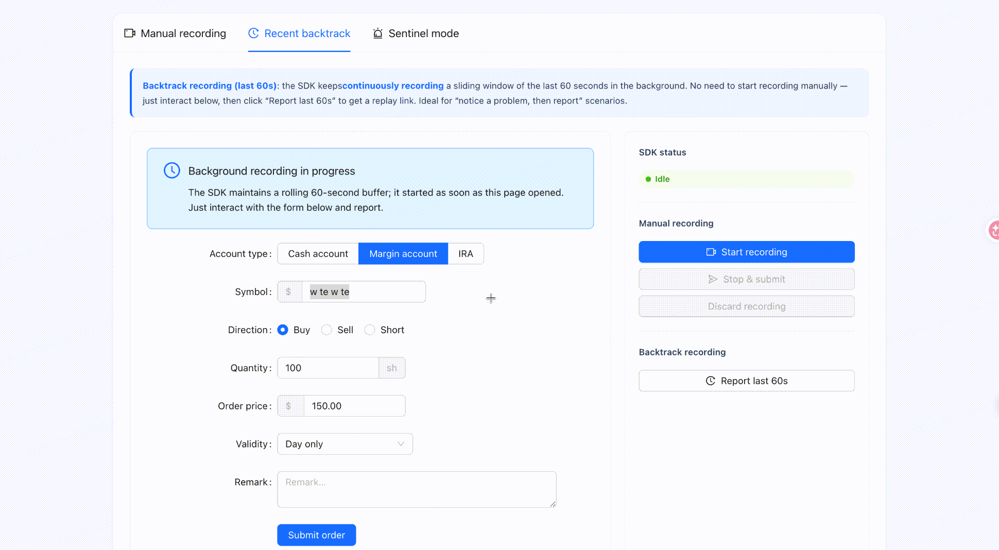
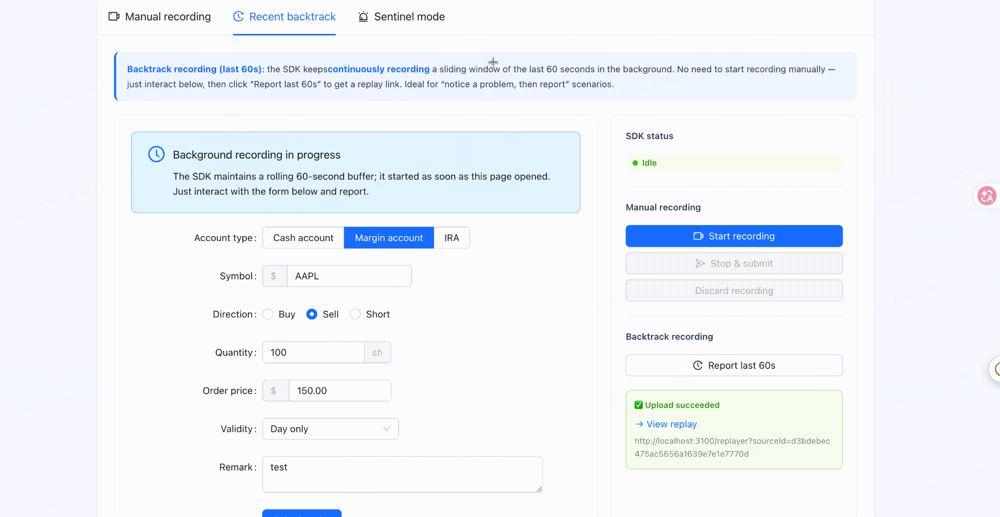
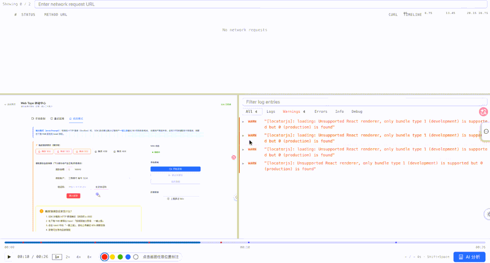
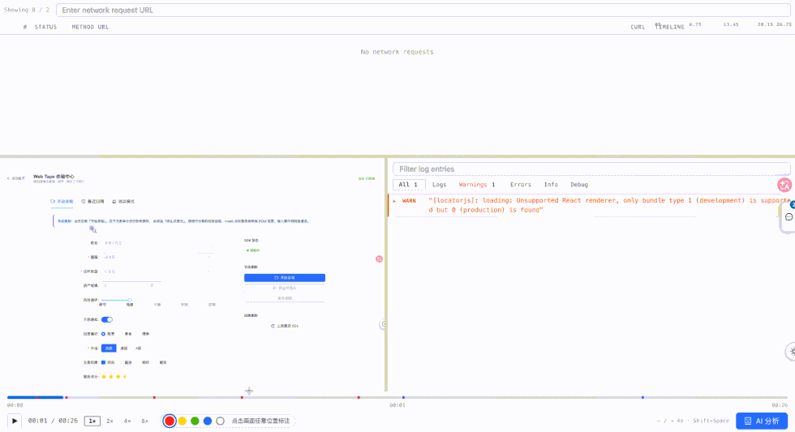

<div align="center">

# 📺 Web Tape

**页面会话录制与回放。** 一行代码即可录制用户操作、网络请求与控制台日志，
再配合时间轴回放、批注沟通、cURL 复现与 AI 摘要——彻底告别「无法复现」。

[English](./README.md) · 简体中文

[](https://www.npmjs.com/package/@webtapejs/toolbox)
[](./LICENSE)

[文档](https://webtape.chenb.xyz/) · [npm](https://www.npmjs.com/package/@webtapejs/toolbox)

<br/>

<b>📼 录制端 · SDK（@webtapejs/toolbox）</b>

<table>
  <tr>
    <td width="50%" align="center">
      
      <br/><sub><b>最近录制 · 一键回溯</b></sub>
    </td>
    <td width="50%" align="center">
      
      <br/><sub><b>哨兵模式 · 异常自动提示</b></sub>
    </td>
  </tr>
</table>

<b>▶️ 回放端 · 自建平台</b>

<table>
  <tr>
    <td width="50%" align="center">
      
      <br/><sub><b>回放定位批注</b></sub>
    </td>
    <td width="50%" align="center">
      
      <br/><sub><b>AI 总结分析</b></sub>
    </td>
  </tr>
</table>

</div>

---

## ✨ 特性

- 🚨 **哨兵模式** —— 监听 HTTP 4xx/5xx，命中时提示一键上报。
- 🔁 **后台滑动窗口** —— 始终在内存保留最近 N 秒，出问题也能事后回溯，无需提前开录。
- 🌐 **全量采集** —— 页面操作、网络请求、控制台日志汇入同一事件流。
- 🎚️ **丰富回放** —— 拖拽进度条、键盘快捷键、画面批注、网络/控制台面板、cURL 复制与 AI 摘要。
- 🌓 **主题与多语言** —— 明暗主题、中英文，运行时可切换。
- 🧩 **零业务侵入** —— 一次 `import` 或一行 `<script>` 即可接入，SDK 完全隔离。

## 🚀 快速开始

### 1. 启动回放服务

录制数据会上传到、并在一个**自建的回放服务**上回放。装了 Docker 后，一行命令拉起（随机密码，无需手写 `.env`）：

```bash
curl -fsSL https://raw.githubusercontent.com/chernbo/webTape/main/deploy/install.sh | bash
```

<details>
<summary><b>可以分步执行</b>（先下载查看脚本，再管理服务）</summary>

```bash
# 1. 下载安装脚本（运行前可先阅读内容）
curl -fsSL https://raw.githubusercontent.com/chernbo/webTape/main/deploy/install.sh -o install.sh

# 2. 运行 —— 生成 .env（随机密码）+ docker-compose.yml，并启动服务
bash install.sh
#   自定义端口：      WEBTAPE_PORT=8080 bash install.sh
#   只生成不启动：    WEBTAPE_NO_START=1 bash install.sh

# 3. 管理服务（在生成的 ./webtape 目录内）
cd webtape
docker compose ps                              # 查看状态
docker compose logs -f replayer                # 跟踪日志
docker compose pull && docker compose up -d    # 更新到最新镜像
docker compose down                            # 停止
docker compose down -v                         # 停止并清空 MySQL 数据卷（重置数据与密码）
```

> 遇到 MySQL `P1000 认证失败`？多半是上次运行残留的 `webtape_mysql-data` 卷里是旧密码。执行 `docker compose down -v` 再 `docker compose up -d` 重新初始化即可。

</details>

然后打开 **http://localhost:3100** —— 它**自带一个体验页，可直接上手体验**（录制 → 生成可分享的回放链接）。上传地址（即 SDK 的 `serverUrl`）为 `http://localhost:3100/api/replayer`。

> 上传接口默认不鉴权 —— Web Tape 是寄生在宿主应用内运行的伴随工具，而非独立服务；若需公网暴露，请在网关层自行加鉴权。

### 2. 接入到你自己的应用（可选）

当你需要**录制另一个前端应用**时，把采集 SDK 通过 **npm** 或一行 **`<script>`** 寄生注入进去，并把 `serverUrl` 指向第 1 步的服务：

```bash
npm install @webtapejs/toolbox
# 或通过 CDN，无需构建：
# <script src="https://unpkg.com/@webtapejs/toolbox/dist/web-tape.iife.js"></script>
```

```ts
import { configure, mountFab } from '@webtapejs/toolbox'

configure({ serverUrl: 'http://localhost:3100/api/replayer', errorPrompt: true, locale: 'zh' })
mountFab() // 可选：内置悬浮按钮；或用 Core API 自行控制录制
```

完整 API、配置与接入指南见 **[文档站](https://webtape.chenb.xyz/)**。

## 🔗 链接

- 📖 **文档**：https://webtape.chenb.xyz/
- 📦 **npm**：[`@webtapejs/toolbox`](https://www.npmjs.com/package/@webtapejs/toolbox)
- 🧩 **SDK 说明**：[`packages/toolbox`](./packages/toolbox#readme)

## ⌨️ 开发

本仓库是 pnpm monorepo（`packages/toolbox` —— SDK · `apps/replayer` —— 回放应用）。

```bash
pnpm install
# SDK：     cd packages/toolbox && pnpm dev
# 回放应用： cd apps/replayer && pnpm dev   # http://localhost:3100
```

## 📄 许可

[MIT](./LICENSE) · 基于 [rrweb](https://github.com/rrweb-io/rrweb) ❤️ 构建，特别感谢 rrweb 团队。
